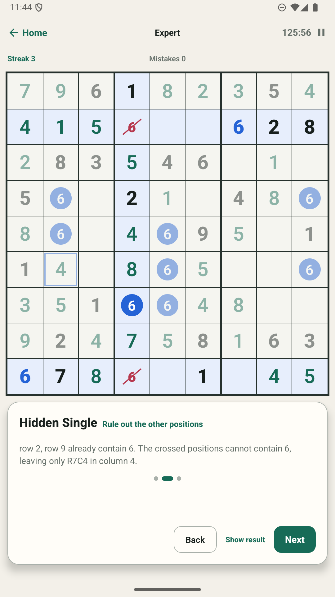
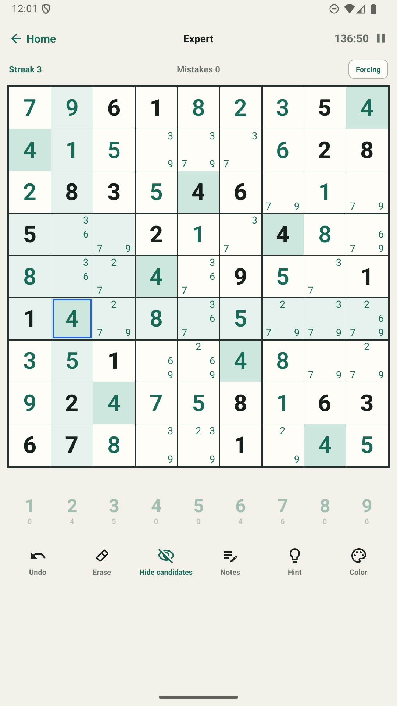
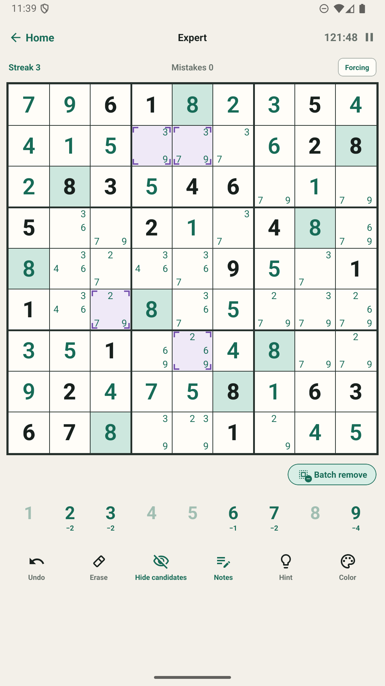
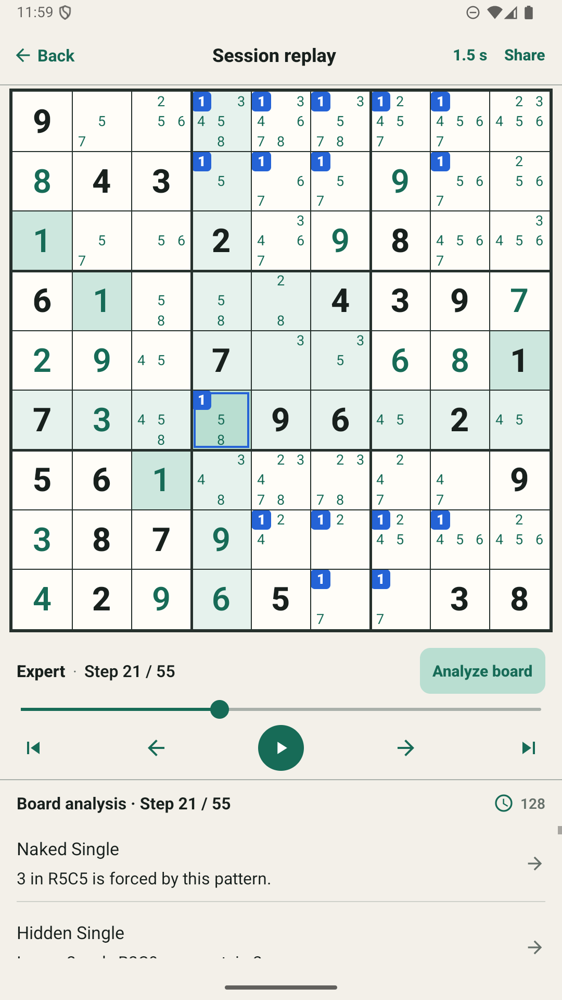

# Platon Sudoku 封闭测试招募帖验收包

状态：**用户已批准提交；2026-09-30 已更新现有 `r/droidapptesters` 帖，并在 `r/alphaandbetausers` 发布首批 5 人安装试跑帖。** 其他频道尚未发布，等待非开发者设备安装结果。整理日期：2026-09-30。

已发布位置：

- [r/droidapptesters 原帖，已加入官方 Play 链接](https://www.reddit.com/r/droidapptesters/comments/1wts7uz/australia_android_sudoku_players_wanted_for_an/)
- [r/alphaandbetausers 首批 5 人招募帖](https://www.reddit.com/r/alphaandbetausers/comments/1wtucry/android_closed_beta_platon_sudoku_looking_for_5/)

## 看什么

1. [英文主帖](post.md)：建议用于 `r/alphaandbetausers`；`r/playtesters` 有单独的精简版本。已填入 Play Console 生成并可打开的官方 opt-in 链接。
2. [频道与发布顺序](channels.md)：每个社区的适用帖型、规则依据、优先级，以及暂不投放的位置。
3. 下列四张为现有真实应用截图的原样副本，准备给 Reddit 图集使用。未加宣传字或修改界面。

| 顺序 | 图 | 图集说明（英文，可复制） |
| --- | --- | --- |
| 1 |  | A hint explains the next logical step. |
| 2 |  | Keep candidate notes while solving. |
| 3 |  | Select and edit several candidates together. |
| 4 |  | Replay moves and inspect the reasoning. |

## 发布前要核对

- Google Play 的本次提交已显示 Published，Alpha 1.0.1 可供选定测试者使用，官方 [Play opt-in 页面](https://play.google.com/apps/testing/com.platongames.sudoku) 已可打开。仍需用非开发者 Google 账号验证群组 → opt-in → 安装。
- 按 `docs/operations/google-play-launch-checklist.md` 的试跑门槛，用非开发者 Android 设备核实安装、更新、提示与反馈入口；把未验证的功能或奖励从文案移除。本文没有承诺 Premium 兑换码，也没有要求评分或评论。
- 群组成员数不可当作 Play opt-in 人数；Play opt-in 也不等于安装。若真实安装失败，先修复流程，再发其他频道。
- 发布当天再看目标社区置顶和规则、选择合适 flair、核对是否允许图集与外链。若编辑器无法同时放图集与正文，优先发完整文本帖，把截图作为附件或在允许时补充到评论；不能让测试步骤和加入方式只留在图片里。
- 用户已批准提交。两处首批测试入口已发布；`r/playtesters`、`r/puzzles` 与站外渠道待安装试跑通过后按频道节奏执行。

`r/alphaandbetausers` 的发帖编辑器提供文本正文，没有可用的图片上传入口，因此首批帖子以完整文字和加入链接发布；四张截图继续保留在本包，供后续允许图文的频道使用。

本包中的截图来源：`.local/google-play/listing/en-GB/screenshots/phone/`。主页截图内容较空，未选为首图。
